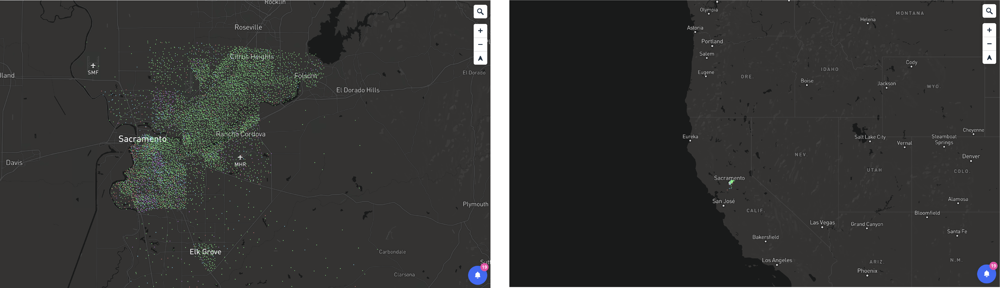

# Mapbox

To get started, you need a Mapbox account and an access token. 

[Sign up for your account here](https://account.mapbox.com/auth/signup/).

Find your default access token and create additional [access tokens here](https://account.mapbox.com/). 

## What's free what's not
Your Mapbox account is free, but some of the things you'll do in Mapbox will incur fees. It's important to know where the free tier cuts off so you can design your graphics according to your newsrooms budget.

[Map loads](https://www.mapbox.com/pricing/) - “A map load is counted every time Mapbox GL JS initializes on a webpage or in a web app. A map load includes unlimited Vector Tiles API and Raster Tiles API requests.” You will get up to 50,000 map loads are free per month.

[Tilesets](https://docs.mapbox.com/studio-manual/reference/tilesets/) - “Tilesets uploaded in Mapbox Studio are free, and do not incur processing or hosting charges. Free uploads via Mapbox Studio are limited to 20 uploads per month, and 300 MB per upload.” If you require more than 20 uploads or your files are larger than 300 MB, you can use [Mapbox Tiling Services](https://docs.mapbox.com/mapbox-tiling-service/guides/) or the [Uploads API](https://docs.mapbox.com/api/maps/uploads/). NOTE: it seems like Mapbox is putting most of its eggs in the MTS basket so if you're trying to decide which alternate Tileset upload method to use, that's probably the one to invest your time in.

## Datasets, Tilesets and Styles

### Datasets
A Mapbox dataset is an editable collection of points, lines or polygons. Much of what you can do with datasets you can do with geographics files in QGIS. Therefore, we will not be going over these much. But I encourage you to [read more about them](https://docs.mapbox.com/studio-manual/reference/datasets/) and see if working with Mapbox datasets is a thing that will work better for you.

### Tilesets (Self-hosting files vs. Mapbox hosting)
Tilesets are geographic data (geojson, shapefiles, etc) that have been converted into vector tiles visible at different zoom levels. That sounds more confusing than it is. Consider the following:

The image on the left is population data for the Meadowview neighborhood in Sacramento at a zoom level of about 9.5. It makes sense for each point to be visible at that zoom level. The image on the right is the same dataset at a zoom level of about 4.5. There is no reason for those points to be rendering at that zoom level because their geographic importance at such a distance is basically nonexistent. 

There are two ways of using geographic data in Mapbox. You can upload the data via Mapbox Studio's Tileset interface, or you can self-host your geojson files.

The biggest benefit to using Mapbox tilesets is performance. From the [Mapbox docs](https://docs.mapbox.com/help/troubleshooting/mapbox-gl-js-performance/#use-vector-tileset-sources): "Use vector tileset sources over GeoJSON data sources when possible. The renderer splits features in vector tilesets into tiles which allows GL JS to load only the features that are visible on the map. Feature geometries are also simplified meaning there are fewer vertices resulting in reduced render, source update, and layer update times."

Your self-hosted data will also be converted into vector tiles, but it will be an on-the-fly process and will not be as optimized as importing your data as a Mapbox tileset.

Another benefit is that you can do more non-code styling of your data using Mapbox Styles.

However, there are some things you cannot do with vector tiles. We will explore such limitations in our "Clustering" HTML example below.

**[Tips](https://docs.mapbox.com/help/troubleshooting/working-with-large-geojson-data/) for reducing the size of your geojson files:**
- IN QGIS: remove unnecessary properties/variables
- IN QGIS: Convert multipart features to singlepart features, if possible
- IN QGIS (or [mapshaper](https://mapshaper.org/)): Simplify overly-complex shapes
- IN MAPBOX: set the `maxZoom` level on your geoJSON source so it's not larger than you need
- IN MAPBOX: if possible, use point clustering for point locator maps. If you can't cluster, allow points to overlap by setting the source `layout` property `icon-allow-overlap` to `true`
- IN MAPBOX: store geoJSON files in a URL rather than loading them as a variable/Object

See more options on this [trouble-shooting guide](https://docs.mapbox.com/help/troubleshooting/uploads/#troubleshooting)

### Styles
Styles are a combination of basemaps and tilesets. By creating and importing new styles, you can change how many basemap features are visible and at which zoom levels they are visible. You can also add tilesets to a style and leverage GUI layer styling. 

## What you can do without code

You can use Style iframes to export maps without much interactivity. You can export maps that have custom basemap features and styled layers, but you won't be able to add UI like popups. 

Read more about [using Style iframes here](https://docs.mapbox.com/help/glossary/iframe/).

## Using Github to host your maps
https://pages.github.com/

## Uploading and styling tilesets and creating Styles in Mapbox
We're going to use the data we manipulated in QGIS to make a few Mapbox maps!

In order to view the results of html code we're about to work with, you'll need to do the following:
- open your computer's terminal
- type `cd [path to this class's folder]`
- once in the correct folder, type `python -m http.server`
- go to `localhost:8000/examples/mapbox-point-popup.html` in your browser and you should see a blank white page. We'll work on making that a map now!

### Example: Basic point locator + popup
First we need to upload our building permit points geojson as a Mapbox Tileset.

Go to [Mapbox > Tilesets](https://studio.mapbox.com/tilesets/), click **New Tileset** and upload the building permit point geojson you created from the QGIS portion of this class. If you weren't able to create that file or your file keeps erroring out for some reason (likely because you didn't project it correctly), you can use [this backup geojson](./GIS/backups/atl-res-permits-mapbox.geojson) I've created for just such an occasion!

Once your building permits file has uploaded, take note of the Tileset ID.

Now we're going to create a Style.

Got to [Mapbox > Styles](https://studio.mapbox.com/) and click **New Style**. Choose a template and a variation that suite your fancy. I would recommend Monochrome Light or Dark because it will be easier to see our points and other layers. Click **Customize**.

Be sure to rename your Style so that it's specific to the project we're working on. Since our project is about ATL building permits, let's call it `ATL-building-permits`.

Here are a few Mapbox-provided helper comments:

On the left sidebar, click on Layers. Then click the grey + button to add a new layer. 

On the New Layer popout, use the Source select box to search for your recently uploaded tileset. Paste the Tileset ID into the search box that appears.

Navigate on the map to where your data should appear.

While still selected on the Layers tab in the sidebar, click on your newly uploaded layer. Yet another sidebar level will popout. 

On the `Select Data` tab of that 3rd tier popout sidebar, you will find:
- **Source:** where to pull the data from. This is where we found our uploaded Tileset.
- **Type:** what type of geography is this data. Different data types have different styling options.
- **Filter:** remove unwanted features from appearing. You should have already done this in QGIS though
- **Zoom extent:** zoom levels at which this data will be visible

Our tileset should have uploaded as type = Circle.

Because we've uploaded a Circle tileset, on the `Style` tab, you will find:
- Radius
- Color
- Blur
- Opacity
- Stroke color, width and opacity
- Translate options
- Pitch options

Let's style our circle radii across zoom levels.

- Click Radius > Style across zoom range.
- Rate of change = linear
- Zoom 0 = 1px
- Zoom 22 = 10px
- Add a stop where the Zoom level = 11 and the pixels = 3

Let's change our circle color and opacity so our circles look more appealing.

- Click Color and choose a color 
- Click Opacity and drop it to .5
- Click Stroke Color and set it to black or whatever goes with your color
- Click Stroke Width and set it to 1. Or maybe you also want to style that across zoom ranges!
- Maybe set the Stroke Opacity as well

Once you're happy with how these circles look, head over to Publish button and publish your Style.

Click Share and copy the Style URL and Access Token. We will need these in our HTML.

Now let's head over to our [Basic point locator + popup](./mapbox-point-popup.html) example HTML and open it using a code editor. These computers come equipped with Sublime, VS Code and Atom. Use what you know and if you don't know any, I suggest you use VS Code.

### [Example: Cluster points + popup](./mapbox-point-cluster.html)
Unfortunately, for [reasons I don't really understand](https://github.com/mapbox/mapbox-gl-js/issues/5856), you cannot cluster vector tilesets. SIGH. But that's ok! Now you know. And this will give us a chance to work with raw geojson as a source.

Open the [Cluster points + popup](./mapbox-point-cluster.html) example HTML with your code editor.

In your browser window, navigate to `localhost:8000/examples/mapbox-point-cluster.html`

### [Example: Layer choropleth + popup](./mapbox-polygon-popup.html)

## Other examples
Here's a list of all of the [Mapbox-hosted examples](https://docs.mapbox.com/mapbox-gl-js/example/).
