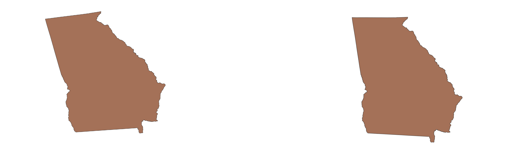
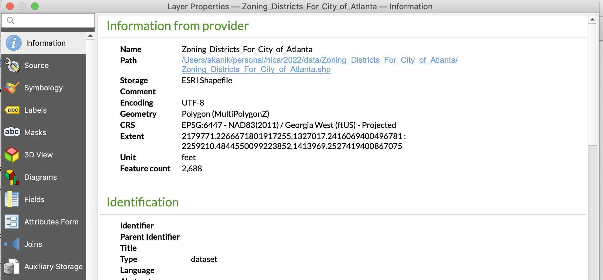

## Things we're not going to cover that might be useful

[Intro to spatial data](https://docs.google.com/document/d/1RQa1SoCTSXt4M-NC93U93vScXxn79sWzqJsDVKmqtPQ/edit#heading=h.b56ghjle2ufi), including an introduction to the different types of geographic elements, types of geographic files, working with non-geographic elements, geocoding and where to find geographic data.

[Intro to QGIS](https://docs.google.com/document/d/1IuPyht3HhYzQNggURBXedp4O4jF6f_lyRoZV10sKrus/edit#heading=h.vq4ekdw46dq3), including what QGIS can/can't do, getting to know panels and toolbars, examining attribute tables, creating new columns and altering data types and saving files.

[Intro to analysis in QGIS](https://docs.google.com/document/d/1LCjMGMst95GeBnMx-dmVQ66-XiaCB3uz6NrZzluYNMk/edit#heading=h.3zw8nxwawury), including styling layer, spatial joins and filtering shapes.

## Adding files

Open a new map in QGIS.

Add the `esri_atl_zips.gpkg` vector file and `atl_res_permits.csv` delimited text file (found in the GIS folder) to the map.

Remember to tell QGIS that your delimited text file has point coordinates so that our permit data will appear as points.

> **_NOTE:_** Zip codes aren't the preferred geographic unit to work with, but sometimes that's how data come to us so we need to make the best of it. We're using the [ESRI Zip Codes](https://www.arcgis.com/home/item.html?id=8d2012a2016e484dafaac0451f9aea24) which come as a `.lyr` file. 

> I've pulled out ATL zips for us to use during this tutorial, but if you want to grab your own city's zip code boundaries, [here are some instructions](https://gis.stackexchange.com/questions/34310/opening-lyr-file-via-rgdal-ogr) on how to convert that `.lyr` file into a `.gdb`. You should then be able to add the `.gdb` directory [using these instructions](https://gis.stackexchange.com/questions/26285/installing-file-geodatabase-gdb-support-in-qgis#:~:text=To%20open%20a%20geodatabase%20in,into%20your%20Table%20of%20Contents.). There is a column called **STATE** that you can use to filter your state's zip codes to get a more manageable file. Once you start joining data to your statewide zip codes, you should be able to filter out zips that aren't being used by the data. 

## Setting project and layer projections

Projections are how we use two-dimensional space to talk about three-dimensional space. Polygons like county and state borders are three-dimensional, but we do our best to show them in two dimensions in print and online.

A coordinate reference system defines how projected space reflects real space. 

If you want to do some more in depth reading on QGIS and projections, you can read [their documentation here](https://docs.qgis.org/3.16/en/docs/user_manual/working_with_projections/working_with_projections.html).

### Geographic vs. projected: points vs. polygons

The best way I’ve ever heard the differentiation between geographic coordinate system (GCS) and projected coordinate systems (PCS) explained is from [Heather Smith at the Arc Blog](https://www.esri.com/arcgis-blog/products/arcgis-pro/mapping/gcs_vs_pcs/):

- A GCS defines where the data is located on the earth’s surface.
- A PCS tells the data how to draw on a flat surface, like on a paper map or a computer screen.

When you’ve got points, whose only definition are location, you want a GCS. When you’ve got lines or polygons, you need to know how to draw the shape on a flat surface, so you need a PCS.

### Which projection should I use and when?

QGIS supports over 7,000 coordinate reference systems, both GCS and PCS. So how do you know which to use and when?

One consideration is visual. A layer’s CRS defines how it will appear on a 2D map. Georgia, when displayed using a projection meant for Texas will look quite misshapen.

A good way to figure out which of the 7,000+ projections to use for your specific area is to download some geographic files provided by your local government. For this session, I went to the [Atlanta Open Data portal](https://www.atlantaga.gov/government/mayor-s-office/executive-offices/office-of-innovation-delivery-and-performance/dataatlanta) and downloaded a geographic file. I opened that file in QGIS, double clicked the layer in the layers panel and looked under then Information tab. The project is listed by the CRS key.

Another consideration in choosing a CRS is alignment. If you are trying to do geospatial analyses with multiple layers, you need to make sure your layers are in the same projection. 

In recent years, QGIS has made great advances in how it works with projection. Currently, when you import a file into QGIS, the system determines the correct projection for that layer based on system settings. If you haven’t changed these settings, your mapping projections are likely set by the first layer that you import into your map.

From QGIS docs:

> “QGIS supports “on the fly” CRS transformation for both raster and vector data. This means that regardless of the underlying CRS of particular map layers in your project, they will always be automatically transformed into the common CRS defined for your project. Behind the scenes, QGIS transparently reprojects all layers contained within your project into the project’s CRS, so that they will all be rendered in the correct position with respect to each other!”

### Changing map projections

If you know which CRS you want your map to be projected with, you can set your projection at the map or project level. Then, all files you import will be "on the fly" projected using that CRS.

To set that projection:

- Import your first file. 
- Go to Project > Properties in the main menu.
- Select the CRS tab.
- Select your desired CRS
- Click OK.

Now all files you add will be visually (on-the-fly) projected to that CRS. If you were to close QGIS and add those same files to a new map, you would find that the projection was project specific and did not stay with the individual geo files.

### Changing file projections

If we do want to create layers with specifically-assigned projections, we can use the QGIS export features function to create those. 

Let's export our `esri_atl_zips` and `atl_res_permits` layers with an Atlanta specific CRS: NAD_1983_2011_StatePlane_Georgia_West_FIPS_1002_Ft_US (EPSG: 6447). 

- Right click your `esri_atl_zips` layer and select Export > Save features as. 

Use the following settings:
- **Format** = GeoPackage
- **File name** = {project-specific GIS directory path}/GIS/esri_atl_zips_proj6447
- **CRS** = EPSG: 6447 - NAD_1983_2011_StatePlane_Georgia_West_FIPS_1002_Ft_US

Keep other options as they are and click OK. 

> You will notice that I have changed the name of the file. We’ve added a `_proj6447` to the end of the filename. This is so we can quickly see that this file is specifically projected. If you have the same file projected in different ways, you will want to have a way of designating the CRS in the filename or at least in the folder containing the files so as not to confuse yourself.

Repeat the above with the `atl_res_permits` layer. Also save this as a geopackage and don't forget to add the CRS suffix.

Remove the non-projected layers.

## Point in polygon

Point in polygon analysis allows you to count points that fall within a polygon. 

In order to see where the most new residences are being built in the city of Atlanta, we can overlay building permits (points) with Atlanta zip codes (polygon) and then ask QGIS to count the number of permits in each zip code.

### Steps:

Go to Vector > Analysis Tools > Count Points in Polygon.

Use the following settings:
- Polygons = `esri_atl_zips`
- Points = `atl_res_permits`
- Count field name = **permit_cnt**

Click Run.

Once the process has completed, you can close the Points in Polygon popup window.

You should see a new layer called Count has been added to the map. If you examine the attribute table, you’ll see that this layer is a copy of the `esri_atl_zips` layer with an added field at the end called **permit_cnt**.

The **permit_cnt** value is a sum of all of the residential permits for each zip code. 

In the Count attribute table, click on the **permit_cnt** column header to sort the table by that column. Once the largest value is at the top, click the index number for the topmost row (it will be 1) to highlight that feature.

Refer back to the map to see which tract has had the most residential building permits since 2018.

## Hexbins

Hexbin analysis is a very popular way to group data points and pull out hotspots. While grouping or aggregating data by other units, such as zip codes or Census tracts, can be very useful, hexbins allow us to create politically-agnostic geographic units. 

This is extremely helpful because many datasets have nothing to do with political or postal boundaries and grouping by them can miss some very important patterns.

### Steps:

(Full props to Mike Corey for the following steps!)

MMQGIS should already be installed as a QGIS plugin. If it's not, go to the plugins main menu, search for and install MMQGIS. 

If you haven't already reprojected your `esri_atl_zips` and `atl_res_permits` layers to be in the same projection, do that now.

Next, we're going to calculate the hexbin short diagonal. Figure out how big you want your grids to be. When doing local analyses, often times I try to make my hexbins the average area of a city block.

For Atlanta, I've observed that many city blocks are between 400 - 600ft long. Let's say that the average is 500ft, which makes for a block with an area of 250,000 sq ft. 

[Use this calculator](https://rechneronline.de/pi/hexagon.php) to find the short diagonal length of a hexagon with an area of 250,000 sq ft. Enter 250000 into the Area (A) field and click Calculate.

Note the result in the Short diagonal (d2) field: 537.

Create the hexbin grid. Navigate to MMQGIS > Create > Create Grid Layer.

Use these settings:
- Geometry type = hexagons
- Extent = Current window (make sure your zoom encompases all the `atl_res_permits` points)
- Layer = `esri_atl_zips`
- Units = Layer Units
- Y Spacing = 537
- Output File Name = the output here will be a layer of hexagons with no data attributes. So we want to call it something pretty general. I like to include the geographic extent of the grid and the y spacing I used to create it. Let’s put this one in a directory called atl-grids and call it atl-grid-537y. That way, if we need to adjust the size of our grid, we can save multiple grid files here and use them accordingly.

Click Apply.

It may take a minute, but you should see a new layer of hexagons added to your map! Add an OpenStreet basemap in order to check whether each hexagon is roughly the size of a city block.

Do a point in polygon analysis. Using the hexagons and the `atl_res_permits`, do a point in polygon analysis like we did above with the zip codes and the `atl_res_permits`.

## QGIS styling for visual analysis

QGIS not only gives you the tools to perform advanced geographic processes, it also allows you to visually style your analysis so that you can quickly understand geographic patterns and trends. 

### Steps:

Open the layer Symbology tab. Double click your point-in-polygon hexagon layer and select the Symbology tab from the left sidebar.

We can select from a variety of different symbology types:
- Single Symbol = a uniform color or fill, line width and opacity for all layer features
- Categorized = style features based on a category column. For example: if you had a political party column that contained values of either republican, democrat, libertarian or other, you could use categorized styling to assign specific styles to each category. 
- Graduated = style features based on a number column. This style method allows you to group or bin number values so you can have specific styles for value ranges.
- Rule-based = style features based on specific rules. This style method allows you to use rules, usually based on feature attribute values, to style individual features.

We will be using Graduated styles today.

Choose Graduated from the dropdown at the top of the Symbology window.

Use these settings:
- Value = **permit_cnt**
- Color ramp = Blues
- Mode = Pretty breaks
- Classes = 5

Click Classify.

Click OK.

Here’s more information on those mode options:

- Mode = the way your value field will be grouped or binned. Let’s use
- Equal Count (Quantile): each bin will have the same number of elements. For example, if you want your data broken into 5 bins, and you have 50 features you’re styling, you would have 10 features in each bin.
- Equal Interval: each bin will have the same size. For example, if you have features with values from 1 to 16 and four classes, each class will have a size of four: 1 - 4, 4 - 8, 8 - 12 and 12 - 16. Bins may contain unequal numbers of features, unlike with quantile mode.
- Logarithmic scale: suitable for data with a wide range of values. Narrow classes for low values and wide classes for large values. For example, for decimal numbers with range [0..100] and two bins, the first bin will be from 0 to 10 and the second bin from 10 to 100). [Read more about logarithmic scales](https://www.forbes.com/sites/naomirobbins/2012/01/19/when-should-i-use-logarithmic-scales-in-my-charts-and-graphs/?sh=45a215075e67) and when to use them.
- Natural Breaks (Jenks): the variance within each bin is minimized while the variance between bins is maximized. As a result, this classification method is good at identifying clusters in the data. 
- Pretty Breaks: bin ranges are chosen so that they are 1, 2 or 5 times a power of 10. As a result, pretty breaks does not always adhere to the number of classes or bins you choose.
- Standard Deviation: bins are built depending on the standard deviation of the values. First the mean is calculated, then each standard deviation from that mean becomes a bin.

[Here’s a good resource on many of these modes](https://gisgeography.com/choropleth-maps-data-classification/) if you’re interested in reading further.

A note on class bounds:

Lower bound NOT included
Upper bound IS included

## Exporting for interactive display

When you’re exporting QGIS data for online display, usually you are exporting individual layers in order to import them into an online program like Mapbox or Carto. 

There are a couple of important considerations for exporting files for online display:
- Projection: depending on the service that you’re uploading your files into, you’ll want to make sure you export your layers with the appropriate project. Mapbox likes to receive files that are projected in the EPSG:4326 - WGS 84
- Scope/size: only export features that you will want to display on your online map. For example, we wouldn’t want to export all of the hexbins that we created. We would want to filter out hexbins with fewer than 1 residential permit so that we’re exporting fewer features. Importing larger files into online mapping programs will both cost more and make your online maps load more slowly.

### Steps:

Filter out hexbins with zero permits. Open the your point-in-polygon hexbin layer’s attribute table and click the "Select features using an expression" button. 

We are going to be filtering out bins with fewer than 1 permit so our expression will read as follows:  "permit_cnt" > 0.

Click Select features.

You should now see that all of the hexbins with permits have been selected!

Save selection. Right click your selected point-in-polygon hexbin layer and select Export > Save selected features as.

Use the following settings:
- Format: GeoJSON
- File name: use the 3 dots to navigated to our project folder and save as `atl-hexbin-res-permits`
- CRS: EPSG:4326 - WGS 84
- Save only selected features: should be checked

Click OK.
